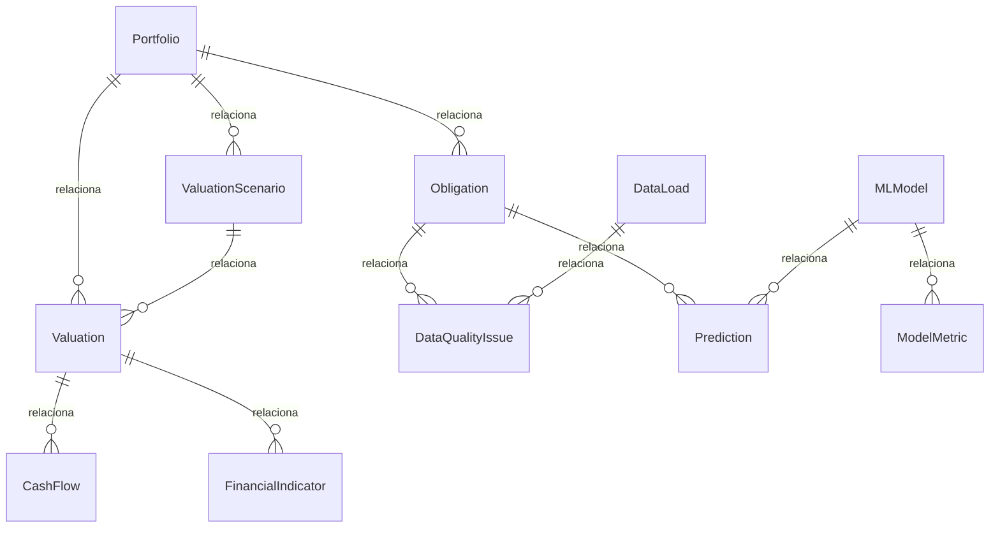

# Modelo Lógico de Datos

**Proyecto:** NPL Portfolio Valuation & Machine Learning

## Entidades

### ENT-001 - Portfolio

Representa una cartera NPL que será analizada y valorada.

#### Campos

| Campo | Tipo | Nullable | Descripción |
|---|---|---|---|
| portfolio_id | UUID | No | Identificador único de la cartera. |
| name | string | No | Nombre descriptivo de la cartera. |
| description | string | Sí | Descripción general de la cartera. |
| acquisition_price | decimal | Sí | Precio pagado o propuesto por la adquisición de la cartera. |
| total_nominal_balance | decimal | No | Saldo nominal total de las obligaciones de la cartera. |
| currency | string | No | Moneda utilizada para los valores financieros de la cartera. |
| created_at | datetime | No | Fecha y hora de creación del registro. |
| status | string | No | Estado operativo de la cartera. |

#### Restricciones

- portfolio_id debe ser único.
- total_nominal_balance debe ser mayor o igual a cero.
- acquisition_price debe ser mayor o igual a cero cuando exista.

#### Relaciones

- **one to many** → ENT-002 - Obligation: Una cartera puede contener múltiples obligaciones.
- **one to many** → ENT-008 - ValuationScenario: Una cartera puede tener múltiples escenarios de valoración.
- **one to many** → ENT-009 - Valuation: Una cartera puede tener múltiples valoraciones.

#### Trazabilidad

**Requerimientos funcionales:**

- RF-008 - Valoración de cartera
- RF-009 - Cálculo de indicadores financieros
- RF-010 - Consulta de resultados

**Casos de uso:**

- CU-008 - Valoración de cartera
- CU-009 - Cálculo de indicadores financieros
- CU-010 - Consulta de resultados

**Reglas de negocio:**

- Ninguna.

---

### ENT-002 - Obligation

Representa cada crédito, deuda u obligación perteneciente a una cartera.

#### Campos

| Campo | Tipo | Nullable | Descripción |
|---|---|---|---|
| obligation_id | UUID | No | Identificador único interno de la obligación. |
| portfolio_id | UUID | No | Identificador de la cartera a la que pertenece la obligación. |
| external_id | string | Sí | Identificador de la obligación en la fuente de origen. |
| debtor_id | string | Sí | Identificador anonimizado o pseudonimizado del deudor. |
| original_amount | decimal | Sí | Valor original de la obligación. |
| outstanding_balance | decimal | No | Saldo vigente de la obligación. |
| days_past_due | integer | Sí | Número de días de mora de la obligación. |
| default_date | date | Sí | Fecha asociada al incumplimiento de la obligación. |
| product_type | string | Sí | Tipo de producto financiero asociado. |
| status | string | No | Estado actual de la obligación. |
| created_at | datetime | No | Fecha y hora de creación del registro. |

#### Restricciones

- obligation_id debe ser único.
- outstanding_balance debe ser mayor o igual a cero.
- original_amount debe ser mayor o igual a cero cuando exista.
- days_past_due debe ser mayor o igual a cero cuando exista.
- Las fechas asociadas a la obligación deben mantener consistencia temporal.

#### Relaciones

- **many to one** → ENT-001 - Portfolio: Cada obligación pertenece a una cartera.
- **one to many** → ENT-004 - DataQualityIssue: Una obligación puede tener múltiples incidencias de calidad.
- **one to many** → ENT-007 - Prediction: Una obligación puede recibir múltiples predicciones.

#### Trazabilidad

**Requerimientos funcionales:**

- RF-001 - Carga de datos históricos
- RF-002 - Validación de calidad de datos
- RF-003 - Transformación de datos
- RF-007 - Predicción de recuperación

**Casos de uso:**

- CU-001 - Carga de datos históricos
- CU-002 - Validación de calidad de datos
- CU-003 - Transformación de datos
- CU-007 - Predicción de recuperación

**Reglas de negocio:**

- RN-021 - Identificación única de obligaciones
- RN-022 - Consistencia del saldo de obligación
- RN-023 - Consistencia de fechas

---

### ENT-003 - DataLoad

Representa cada proceso de carga de información.

#### Campos

| Campo | Tipo | Nullable | Descripción |
|---|---|---|---|
| load_id | UUID | No | Identificador único del proceso de carga. |
| source_name | string | No | Nombre de la fuente de datos. |
| source_type | string | No | Tipo de fuente utilizada. |
| file_name | string | Sí | Nombre del archivo recibido cuando corresponda. |
| received_records | integer | No | Cantidad total de registros recibidos. |
| valid_records | integer | No | Cantidad de registros considerados válidos. |
| invalid_records | integer | No | Cantidad de registros con incidencias. |
| status | string | No | Estado del proceso de carga. |
| loaded_at | datetime | No | Fecha y hora de ejecución de la carga. |

#### Restricciones

- load_id debe ser único.
- received_records debe ser mayor o igual a cero.
- valid_records debe ser mayor o igual a cero.
- invalid_records debe ser mayor o igual a cero.
- La suma de registros válidos e inválidos no debe superar los registros recibidos.

#### Relaciones

- **one to many** → ENT-004 - DataQualityIssue: Una carga puede producir múltiples incidencias de calidad.

#### Trazabilidad

**Requerimientos funcionales:**

- RF-001 - Carga de datos históricos

**Casos de uso:**

- CU-001 - Carga de datos históricos

**Reglas de negocio:**

- RN-001 - Validación de estructura de datos
- RN-004 - Persistencia posterior a validación
- RN-024 - Reproducibilidad de resultados

---

### ENT-004 - DataQualityIssue

Representa incidencias detectadas durante los procesos de calidad de datos.

#### Campos

| Campo | Tipo | Nullable | Descripción |
|---|---|---|---|
| issue_id | UUID | No | Identificador único de la incidencia. |
| load_id | UUID | No | Identificador de la carga donde se detectó la incidencia. |
| obligation_id | UUID | Sí | Identificador de la obligación afectada cuando corresponda. |
| rule_code | string | No | Código de la regla o validación que generó la incidencia. |
| issue_type | string | No | Tipo de incidencia detectada. |
| field_name | string | Sí | Campo afectado por la incidencia. |
| detected_value | string | Sí | Valor detectado que originó la incidencia. |
| severity | string | No | Severidad de la incidencia. |
| status | string | No | Estado de tratamiento de la incidencia. |
| detected_at | datetime | No | Fecha y hora en que se detectó la incidencia. |

#### Restricciones

- issue_id debe ser único.
- load_id debe referenciar una carga existente.
- severity debe utilizar valores controlados.
- status debe utilizar valores controlados.

#### Relaciones

- **many to one** → ENT-003 - DataLoad: Cada incidencia pertenece a una carga de datos.
- **many to one optional** → ENT-002 - Obligation: Una incidencia puede estar asociada a una obligación específica.

#### Trazabilidad

**Requerimientos funcionales:**

- RF-002 - Validación de calidad de datos

**Casos de uso:**

- CU-002 - Validación de calidad de datos

**Reglas de negocio:**

- RN-001 - Validación de estructura de datos
- RN-002 - Control de registros duplicados
- RN-003 - Control de valores inválidos
- RN-022 - Consistencia del saldo de obligación
- RN-023 - Consistencia de fechas

---

### ENT-005 - MLModel

Representa un modelo de Machine Learning entrenado dentro del sistema.

#### Campos

| Campo | Tipo | Nullable | Descripción |
|---|---|---|---|
| model_id | UUID | No | Identificador único del modelo. |
| name | string | No | Nombre del modelo. |
| algorithm | string | No | Algoritmo de Machine Learning utilizado. |
| version | string | No | Versión del modelo. |
| target_variable | string | No | Variable objetivo utilizada durante el entrenamiento. |
| feature_set | JSON | No | Conjunto de variables predictoras utilizadas. |
| parameters | JSON | No | Parámetros utilizados para entrenar el modelo. |
| training_dataset_version | string | No | Versión del dataset utilizado durante el entrenamiento. |
| status | string | No | Estado del modelo dentro de su ciclo de vida. |
| trained_at | datetime | No | Fecha y hora de entrenamiento. |

#### Restricciones

- model_id debe ser único.
- La combinación de nombre y versión debe permitir identificar un modelo de forma inequívoca.
- Un modelo utilizado para predicción debe encontrarse previamente evaluado y aprobado.

#### Relaciones

- **one to many** → ENT-006 - ModelMetric: Un modelo puede tener múltiples métricas de evaluación.
- **one to many** → ENT-007 - Prediction: Un modelo puede generar múltiples predicciones.

#### Trazabilidad

**Requerimientos funcionales:**

- RF-005 - Entrenamiento de modelos
- RF-006 - Comparación de modelos
- RF-007 - Predicción de recuperación

**Casos de uso:**

- CU-005 - Entrenamiento de modelos
- CU-006 - Comparación de modelos
- CU-007 - Predicción de recuperación

**Reglas de negocio:**

- RN-005 - Evaluación obligatoria de modelos
- RN-006 - Comparación de modelos
- RN-014 - Trazabilidad del modelo utilizado
- RN-016 - Separación entre entrenamiento y evaluación
- RN-017 - Control de fuga de información
- RN-024 - Reproducibilidad de resultados

---

### ENT-006 - ModelMetric

Representa las métricas obtenidas durante la evaluación de los modelos.

#### Campos

| Campo | Tipo | Nullable | Descripción |
|---|---|---|---|
| metric_id | UUID | No | Identificador único de la métrica. |
| model_id | UUID | No | Identificador del modelo evaluado. |
| dataset_type | string | No | Tipo de dataset utilizado para calcular la métrica. |
| metric_name | string | No | Nombre de la métrica calculada. |
| metric_value | decimal | No | Valor obtenido para la métrica. |
| calculated_at | datetime | No | Fecha y hora de cálculo de la métrica. |

#### Restricciones

- metric_id debe ser único.
- model_id debe referenciar un modelo existente.
- metric_value debe encontrarse dentro del rango válido de la métrica correspondiente.

#### Relaciones

- **many to one** → ENT-005 - MLModel: Cada métrica pertenece a un modelo.

#### Trazabilidad

**Requerimientos funcionales:**

- RF-005 - Entrenamiento de modelos
- RF-006 - Comparación de modelos

**Casos de uso:**

- CU-005 - Entrenamiento de modelos
- CU-006 - Comparación de modelos

**Reglas de negocio:**

- RN-005 - Evaluación obligatoria de modelos
- RN-006 - Comparación de modelos
- RN-018 - Registro de métricas del modelo
- RN-019 - Backtesting de modelos

---

### ENT-007 - Prediction

Representa una predicción de recuperación generada para una obligación.

#### Campos

| Campo | Tipo | Nullable | Descripción |
|---|---|---|---|
| prediction_id | UUID | No | Identificador único de la predicción. |
| obligation_id | UUID | No | Identificador de la obligación evaluada. |
| model_id | UUID | No | Identificador del modelo utilizado. |
| recovery_probability | decimal | No | Probabilidad estimada de recuperación. |
| expected_recovery_amount | decimal | Sí | Valor esperado de recuperación cuando sea calculado. |
| prediction_date | datetime | No | Fecha y hora de generación de la predicción. |
| model_version | string | No | Versión del modelo utilizado. |

#### Restricciones

- prediction_id debe ser único.
- recovery_probability debe encontrarse entre 0 y 1.
- expected_recovery_amount debe ser mayor o igual a cero cuando exista.
- model_id debe referenciar un modelo evaluado y aprobado.

#### Relaciones

- **many to one** → ENT-002 - Obligation: Cada predicción pertenece a una obligación.
- **many to one** → ENT-005 - MLModel: Cada predicción es generada por un modelo.

#### Trazabilidad

**Requerimientos funcionales:**

- RF-007 - Predicción de recuperación

**Casos de uso:**

- CU-007 - Predicción de recuperación

**Reglas de negocio:**

- RN-007 - Predicciones basadas en modelos aprobados
- RN-008 - Probabilidad de recuperación acotada
- RN-014 - Trazabilidad del modelo utilizado
- RN-024 - Reproducibilidad de resultados

---

### ENT-008 - ValuationScenario

Representa los supuestos utilizados para valorar una cartera.

#### Campos

| Campo | Tipo | Nullable | Descripción |
|---|---|---|---|
| scenario_id | UUID | No | Identificador único del escenario. |
| portfolio_id | UUID | No | Identificador de la cartera asociada. |
| name | string | No | Nombre del escenario de valoración. |
| discount_rate | decimal | No | Tasa de descuento utilizada para descontar flujos futuros. |
| recovery_cost_rate | decimal | Sí | Tasa estimada de costos de recuperación. |
| description | string | Sí | Descripción de los supuestos del escenario. |
| created_at | datetime | No | Fecha y hora de creación del escenario. |

#### Restricciones

- scenario_id debe ser único.
- discount_rate debe ser mayor o igual a cero.
- recovery_cost_rate debe ser mayor o igual a cero cuando exista.

#### Relaciones

- **many to one** → ENT-001 - Portfolio: Cada escenario pertenece a una cartera.
- **one to many** → ENT-009 - Valuation: Un escenario puede utilizarse en múltiples valoraciones.

#### Trazabilidad

**Requerimientos funcionales:**

- RF-008 - Valoración de cartera
- RF-009 - Cálculo de indicadores financieros

**Casos de uso:**

- CU-008 - Valoración de cartera
- CU-009 - Cálculo de indicadores financieros

**Reglas de negocio:**

- RN-011 - Aplicación de tasa de descuento
- RN-012 - Consideración de costos de recuperación
- RN-020 - Escenarios de valoración

---

### ENT-009 - Valuation

Representa el resultado de valorar financieramente una cartera.

#### Campos

| Campo | Tipo | Nullable | Descripción |
|---|---|---|---|
| valuation_id | UUID | No | Identificador único de la valoración. |
| portfolio_id | UUID | No | Identificador de la cartera valorada. |
| scenario_id | UUID | No | Identificador del escenario aplicado. |
| expected_recovery | decimal | No | Recuperación económica esperada de la cartera. |
| recovery_cost | decimal | Sí | Costos estimados asociados a la recuperación. |
| present_value | decimal | Sí | Valor presente de los flujos de recuperación. |
| valuation_date | datetime | No | Fecha y hora de ejecución de la valoración. |
| status | string | No | Estado de la valoración. |

#### Restricciones

- valuation_id debe ser único.
- expected_recovery debe ser mayor o igual a cero.
- recovery_cost debe ser mayor o igual a cero cuando exista.

#### Relaciones

- **many to one** → ENT-001 - Portfolio: Cada valoración pertenece a una cartera.
- **many to one** → ENT-008 - ValuationScenario: Cada valoración utiliza un escenario de valoración.
- **one to many** → ENT-010 - CashFlow: Una valoración puede generar múltiples flujos financieros.
- **one to many** → ENT-011 - FinancialIndicator: Una valoración puede generar múltiples indicadores financieros.

#### Trazabilidad

**Requerimientos funcionales:**

- RF-008 - Valoración de cartera

**Casos de uso:**

- CU-008 - Valoración de cartera

**Reglas de negocio:**

- RN-009 - Valoración basada en recuperación esperada
- RN-011 - Aplicación de tasa de descuento
- RN-012 - Consideración de costos de recuperación
- RN-015 - Trazabilidad de resultados financieros
- RN-020 - Escenarios de valoración

---

### ENT-010 - CashFlow

Representa los flujos proyectados de recuperación.

#### Campos

| Campo | Tipo | Nullable | Descripción |
|---|---|---|---|
| cash_flow_id | UUID | No | Identificador único del flujo. |
| valuation_id | UUID | No | Identificador de la valoración asociada. |
| period | integer | No | Periodo temporal al que corresponde el flujo. |
| recovery_amount | decimal | No | Valor de recuperación proyectado para el periodo. |
| recovery_cost | decimal | Sí | Costo de recuperación proyectado para el periodo. |
| net_cash_flow | decimal | No | Flujo neto obtenido después de considerar costos. |
| discounted_cash_flow | decimal | Sí | Flujo neto descontado a valor presente. |

#### Restricciones

- cash_flow_id debe ser único.
- period debe ser mayor o igual a cero.
- recovery_amount debe ser mayor o igual a cero.
- recovery_cost debe ser mayor o igual a cero cuando exista.

#### Relaciones

- **many to one** → ENT-009 - Valuation: Cada flujo pertenece a una valoración.

#### Trazabilidad

**Requerimientos funcionales:**

- RF-008 - Valoración de cartera
- RF-009 - Cálculo de indicadores financieros

**Casos de uso:**

- CU-008 - Valoración de cartera
- CU-009 - Cálculo de indicadores financieros

**Reglas de negocio:**

- RN-011 - Aplicación de tasa de descuento
- RN-012 - Consideración de costos de recuperación
- RN-013 - Flujos de recuperación no negativos

---

### ENT-011 - FinancialIndicator

Representa los indicadores financieros calculados para una valoración.

#### Campos

| Campo | Tipo | Nullable | Descripción |
|---|---|---|---|
| indicator_id | UUID | No | Identificador único del indicador. |
| valuation_id | UUID | No | Identificador de la valoración asociada. |
| indicator_name | string | No | Nombre del indicador financiero. |
| indicator_value | decimal | No | Valor calculado para el indicador. |
| calculated_at | datetime | No | Fecha y hora de cálculo del indicador. |

#### Restricciones

- indicator_id debe ser único.
- valuation_id debe referenciar una valoración existente.
- indicator_name debe utilizar valores soportados por el sistema.

#### Relaciones

- **many to one** → ENT-009 - Valuation: Cada indicador pertenece a una valoración.

#### Trazabilidad

**Requerimientos funcionales:**

- RF-009 - Cálculo de indicadores financieros

**Casos de uso:**

- CU-009 - Cálculo de indicadores financieros

**Reglas de negocio:**

- RN-010 - Cálculo obligatorio de indicadores financieros
- RN-015 - Trazabilidad de resultados financieros
- RN-020 - Escenarios de valoración

---

### ENT-012 - ProcessExecution

Representa la ejecución de procesos para auditoría, trazabilidad y reproducibilidad.

#### Campos

| Campo | Tipo | Nullable | Descripción |
|---|---|---|---|
| execution_id | UUID | No | Identificador único de la ejecución. |
| process_type | string | No | Tipo general de proceso ejecutado. |
| process_name | string | No | Nombre específico del proceso. |
| input_reference | string | Sí | Referencia a los datos o artefactos utilizados como entrada. |
| parameters | JSON | Sí | Parámetros utilizados durante la ejecución. |
| status | string | No | Estado de la ejecución. |
| started_at | datetime | No | Fecha y hora de inicio de la ejecución. |
| finished_at | datetime | Sí | Fecha y hora de finalización. |
| error_message | string | Sí | Mensaje de error cuando la ejecución falla. |

#### Restricciones

- execution_id debe ser único.
- finished_at no puede ser anterior a started_at cuando exista.
- status debe utilizar valores controlados.

#### Relaciones

No se han definido relaciones.

#### Trazabilidad

**Requerimientos funcionales:**

- RF-001 - Carga de datos históricos
- RF-003 - Transformación de datos
- RF-005 - Entrenamiento de modelos
- RF-007 - Predicción de recuperación
- RF-008 - Valoración de cartera
- RF-009 - Cálculo de indicadores financieros

**Casos de uso:**

- CU-001 - Carga de datos históricos
- CU-003 - Transformación de datos
- CU-005 - Entrenamiento de modelos
- CU-007 - Predicción de recuperación
- CU-008 - Valoración de cartera
- CU-009 - Cálculo de indicadores financieros

**Reglas de negocio:**

- RN-014 - Trazabilidad del modelo utilizado
- RN-015 - Trazabilidad de resultados financieros
- RN-018 - Registro de métricas del modelo
- RN-024 - Reproducibilidad de resultados

---

## Diagrama lógico de relaciones

## Matriz de trazabilidad

| Entidad | Requerimientos | Casos de uso | Reglas de negocio |
|---|---|---|---|
| ENT-001 - Portfolio | RF-008, RF-009, RF-010 | CU-008, CU-009, CU-010 | - |
| ENT-002 - Obligation | RF-001, RF-002, RF-003, RF-007 | CU-001, CU-002, CU-003, CU-007 | RN-021, RN-022, RN-023 |
| ENT-003 - DataLoad | RF-001 | CU-001 | RN-001, RN-004, RN-024 |
| ENT-004 - DataQualityIssue | RF-002 | CU-002 | RN-001, RN-002, RN-003, RN-022, RN-023 |
| ENT-005 - MLModel | RF-005, RF-006, RF-007 | CU-005, CU-006, CU-007 | RN-005, RN-006, RN-014, RN-016, RN-017, RN-024 |
| ENT-006 - ModelMetric | RF-005, RF-006 | CU-005, CU-006 | RN-005, RN-006, RN-018, RN-019 |
| ENT-007 - Prediction | RF-007 | CU-007 | RN-007, RN-008, RN-014, RN-024 |
| ENT-008 - ValuationScenario | RF-008, RF-009 | CU-008, CU-009 | RN-011, RN-012, RN-020 |
| ENT-009 - Valuation | RF-008 | CU-008 | RN-009, RN-011, RN-012, RN-015, RN-020 |
| ENT-010 - CashFlow | RF-008, RF-009 | CU-008, CU-009 | RN-011, RN-012, RN-013 |
| ENT-011 - FinancialIndicator | RF-009 | CU-009 | RN-010, RN-015, RN-020 |
| ENT-012 - ProcessExecution | RF-001, RF-003, RF-005, RF-007, RF-008, RF-009 | CU-001, CU-003, CU-005, CU-007, CU-008, CU-009 | RN-014, RN-015, RN-018, RN-024 |
